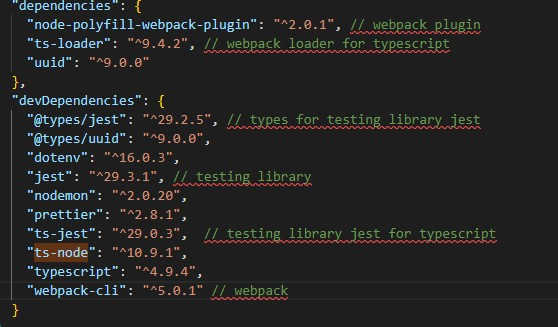

task: https://github.com/AlreadyBored/nodejs-assignments/blob/main/assignments/crud-api/assignment.md

Only allowed libraries are used:


## Common setup

Clone the repo:

```bash
git clone https://github.com/LiliyaSm/crud-api.git

```

Change directory:

```bash
cd crud-api
```

Checkout to the development branch:

```bash
 git checkout development
```

Install the dependencies:

```bash
npm install
```

To run the app in development mode (using nodemon):

```bash
npm run start:dev
```

To run the app in production mode (the bundle is building using webpack):

```bash
npm run start:prod
```

To run the app using multiple instances of application (Node.js Cluster API),
the database will be launched in a separate process and workers will access it using HTTP requests:

```bash
npm run start:multi
```

To run tests (3 test cases)

```bash
npm run test
```

## Endpoints:

- **GET** `api/users` - to get list of all users

- **GET** `api/users/${userId}` - to get user by id (uuid)

- **POST** `api/users` - to create new user

- **PUT** `api/users/${userId}` - to update existing user

- **DELETE**  `api/users/${userId}` - to delete existing user

example body JSON (all fields are required!):

```json
{
  "username": string,
  "age": number,
  "hobbies": []
}
```